# Family Identity, Relationship Verification & Beneficiary Management Platform — System Architecture

A production-grade, enterprise system architecture specification for a state/national Digital Public Infrastructure (DPI) platform managing household registration, graph relationship verification, AI/algorithmic deduplication, and Direct Benefit Transfer (DBT) scheme entitlement.

---

## 1. High-Level Architecture Overview (5-Layer Model)

```mermaid
graph LR
%% 5-Layer End-to-End Architecture
    subgraph L1["Layer 1: Users & External Actors"]
        A1["👤 Citizen / Family Head"]
        A2["🏛️ Government Officer"]
        A3["🏢 District / Taluka Admin"]
        A4["💼 Scheme Departments"]
    end

    subgraph L2["Layer 2: Presentation Layer (React / TS / Tailwind)"]
        UI1["📱 Citizen Web & Mobile App<br/>(Family Tree, Uploads, Schemes)"]
        UI2["🖥️ Officer & Admin Dashboard<br/>(Verification Queue, Cluster Resolvers)"]
    end

    subgraph L3["Layer 3: API Gateway & Backend Services Layer"]
        GW["🛡️ API Gateway / Reverse Proxy<br/>(Node.js / Express / JWT / RBAC / Rate Limiter)"]
        
        subgraph Services["Modular Micro-Services"]
            S1["1. Auth & RBAC"]
            S2["2. Family Reg Service"]
            S3["3. Family ID Service"]
            S4["4. Member Service"]
            S5["5. Relationship Service"]
            S6["6. Doc Verify Service"]
            S7["7. Deduplication Svc"]
            S8["8. Scheme & DBT Svc"]
            S9["9. Notification Svc"]
            S10["10. Audit Log Svc"]
            S11["11. Analytics & KPI"]
        end

        subgraph CoreEngines["Core Engines"]
            E1["⚙️ Family Identity & Tree Engine"]
            E2["⚡ Multi-Pass Deduplication Engine"]
            E3["📑 Secure Document Pipeline"]
        end
    end

    subgraph L4["Layer 4: Data, Storage & Identity Layer"]
        ID_GW["🆔 Identity Verification Gateway<br/>(Tokenized Reference - No Raw Aadhaar)"]
        DB[("🗄️ Relational Primary DB<br/>PostgreSQL / MySQL<br/>ACID • Multi-AZ • AES-256")]
        CACHE[("⚡ Redis Cache & Queue<br/>Sessions • Rate Limits • BullMQ")]
        OBJ[("📦 S3-Compatible Object Store<br/>Encrypted Documents • Pre-signed URLs")]
    end

    subgraph L5["Layer 5: Govt Schemes, Notifications & Analytics"]
        SCHEMES["🏛️ External Welfare Schemes<br/>(Ration, Housing, Scholarships, Health, Pension, Agri)"]
        NOTIF["📢 Notification Gateways<br/>(SMS / DLT, Email, WhatsApp)"]
        ANALYTICS["📊 Executive Analytics Engine<br/>(District/Taluka Dashboards, SQL Views)"]
    end

    %% Flows
    A1 -->|HTTPS / TLS| UI1
    A2 -->|HTTPS / TLS| UI2
    A3 -->|HTTPS / TLS| UI2
    A4 -.->|Secure REST API| GW

    UI1 -->|REST API Requests| GW
    UI2 -->|REST API Requests| GW

    GW --> Services
    Services --> CoreEngines

    CoreEngines -->|Tokenization Check| ID_GW
    CoreEngines -->|Persistent Storage| DB
    CoreEngines -->|Cache & Queues| CACHE
    CoreEngines -->|Encrypted Uploads| OBJ

    Services -->|Disbursal API / Webhooks| SCHEMES
    Services -->|Event Triggers| NOTIF
    DB -->|Read Replicas & Aggregates| ANALYTICS
```



---

## 2. Interactive Diagram & Visual Assets

* **Interactive HTML Viewer & 1080p Exporter**: [`docs/architecture-diagram.html`](file:///e:/Pravi_project/docs/architecture-diagram.html)
* **Production 16:9 Landscape Vector SVG**: [`docs/architecture-diagram.svg`](file:///e:/Pravi_project/docs/architecture-diagram.svg)

---

## 3. Detailed Architectural Layers

### Layer 1: Users & External Actors
* **Citizen / Family Head**: Registers household, completes KYC, adds family members, claims biological/marital relationships, uploads supporting proof (ration card, birth certificate, legal affidavits), views issued Family ID (`FAM-YYYY-XXXX`), discovers eligible government welfare schemes, and tracks benefit claims.
* **Government Officer**: Reviews assigned jurisdictional verification queue, scrutinizes uploaded proofs side-by-side with claimed data, approves/rejects/returns member claims with official remarks, and resolves suspected duplicate identity clusters.
* **District / Taluka Administrator**: Manages officer RBAC roles, jurisdictional boundaries, monitors service level agreements (SLAs), handles escalated duplicate merges/splits, and accesses executive dashboards.
* **Government Scheme Departments**: Interacts via secure REST APIs to verify beneficiary family composition, evaluate automated eligibility criteria, execute Direct Benefit Transfer (DBT), and push disbursement status updates.

### Layer 2: Frontend / Presentation Layer
* **Technology Stack**: React 18, TypeScript, Tailwind CSS, React Router, Axios, React Flow (for interactive generation-aware Family Tree visualizer), Lucide Icons, and Zod client validation.
* **Security at Presentation**:
  * Strict HTTPS communication with Content Security Policy (CSP).
  * In-memory token management with automated token refresh.
  * Zero client-side storage of sensitive biometric or raw identity tokens.

### Layer 3: API Gateway & Backend Services Layer
* **Technology Stack**: Node.js, Express.js, TypeScript, RESTful JSON APIs, Prisma ORM / SQL query builders.
* **Unified API Gateway**:
  * Edge authentication & JWT token validation.
  * Role-Based Access Control (RBAC) middleware verifying caller permissions per endpoint.
  * Dynamic IP and user-based token bucket rate limiting (via Redis).
  * Request payload validation & sanitization against OWASP Top 10 vulnerabilities.
* **Modular Services**:
  1. **Authentication & Authorization**: Password hashing (Argon2/Bcrypt), JWT issuance, refresh rotation, MFA/OTP verification.
  2. **Family Registration**: Draft state handling, address assignment, household formation.
  3. **Family ID Management**: Generation of state-standard unique identifier (`FAM-XXXX-XXXX`) with checksum verification and cryptographic QR generation.
  4. **Member Management**: Lifecycle tracking (`ACTIVE`, `DECEASED`, `MIGRATED`, `SEPARATED`), Family Head reassignment without orphaned families.
  5. **Relationship Management**: Graph validation enforcing genealogical consistency (age hierarchy, gender constraints, singular biological father/mother rules).
  6. **Document Verification**: MIME verification, virus scanning, signed URL access, officer approval pipeline.
  7. **Duplicate Detection Engine**: Multi-pass matching algorithm (Exact + Levenshtein / Jaro-Winkler + Soundex phonetic matching) running asynchronously on BullMQ queues.
  8. **Beneficiary & Scheme Management**: Dynamic rule evaluation (income tier, caste category, land holding, gender/age demographics), quota caps, DBT tracking.
  9. **Notification Service**: Transactional SMS (DLT-registered), Email (SMTP/SES), and WhatsApp webhooks for status transitions.
  10. **Audit & Activity Service**: Immutable event streaming capturing `User`, `Action`, `Timestamp`, `Previous Value`, `New Value`, `Officer Reason`, and `IP Address`.
  11. **Reporting & Analytics Service**: Materialized view aggregates for district, taluka, and village-level saturation metrics.

### Layer 4: Data, Storage & Identity Layer
* **Identity Verification Gateway**:
  * Connects to approved state identity verification backends.
  * **Strict Zero-Raw PII Policy**: Under no circumstance are raw national identity / Aadhaar numbers stored in the database. Raw identifiers are verified in memory via secure upstream APIs, transformed into one-way cryptographic tokens / reference UUIDs, and stored as `IdentityReference`.
* **Relational Database (PostgreSQL / MySQL)**:
  * Entities: `Family`, `FamilyMember`, `Relationship`, `IdentityReference`, `Address`, `Document`, `Verification`, `Scheme`, `Beneficiary`, `Application`, `Benefit`, `Officer`, `AuditLog`.
  * ACID transaction isolation, foreign key referential integrity, AES-256 tablespace encryption, and multi-AZ replication.
* **In-Memory Cache & Job Queue (Redis)**:
  * Manages active user sessions, token blacklists, API rate limiting counters, and async queue workers (BullMQ for deduplication and DBT webhooks).
* **Object Storage (S3-Compatible)**:
  * Secure, access-controlled storage for uploaded identity, ration, birth, and affidavit proofs.
  * Stored files use random UUID keys (never client-supplied filenames).
  * Accessed strictly via short-lived (60s) HMAC-signed pre-signed URLs.

### Layer 5: External Government Systems, Notifications & Analytics
* **Integrated Welfare Schemes**:
  * Ration & Food Security (NFSA / PDS grain allocation)
  * Housing (PMAY construction subsidies)
  * Direct Education Scholarships
  * Tertiary Health Insurance (PM-JAY)
  * Senior Citizen, Widow & Disability Pensions
  * Agriculture & Farmer Subsidies (PM-KISAN)
* **Notification Gateways**: SMS / DLT gateway, transactional email, and automated push notifications.
* **Analytics & Intelligence**: SQL aggregate read-replicas powering Chart.js / Recharts visualization for district magistrates and scheme directors.

---

## 4. End-to-End Primary Lifecycle Workflow

```mermaid
sequenceDiagram
    autonumber
    actor C as Citizen / Family Head
    participant UI as Presentation App
    participant GW as API Gateway
    participant FS as Family & Member Svc
    participant DUP as Deduplication Engine
    participant DOC as Secure Doc Storage
    actor OFF as Government Officer
    participant SCH as Scheme & DBT System
    participant AUD as Immutable Audit Log

    C->>UI: 1. Register Household & Initiate KYC
    UI->>GW: 2. Submit Identity Claim
    GW->>FS: 3. Tokenize ID & Create Family Draft
    FS->>DUP: 4. Trigger Async Duplicate Detection
    DUP-->>FS: 5. Deduplication Check (No High-Confidence Duplicate)
    FS-->>UI: 6. Issue Pending Family ID (FAM-XXXX)
    
    C->>UI: 7. Add Members & Define Relationship Graph
    C->>UI: 8. Upload Supporting Documents (Ration / Birth / Affidavit)
    UI->>DOC: 9. Encrypted Direct Stream to S3 Storage
    UI->>GW: 10. Final Household Submission
    GW->>AUD: 11. Log State Transition [DRAFT -> SUBMITTED]

    OFF->>UI: 12. Review Verification Queue & Inspect Evidence
    OFF->>GW: 13. Approve Family & Member Relationships
    GW->>FS: 14. Freeze Verified Profiles & Issue Digital Family Pass
    GW->>AUD: 15. Record Officer Decision + Reason + Timestamp

    SCH->>GW: 16. Query Verified Family for Scheme Eligibility
    GW->>SCH: 17. Return Verified Household Profile & Beneficiary Mapping
    SCH->>C: 18. Disburse Direct Benefit (DBT) & Send SMS Alert
```

---

## 5. Security, Governance & Compliance Matrix

| Security Domain | Implementation Standard |
| :--- | :--- |
| **Transport Security** | TLS 1.3 / HTTPS enforced with HSTS headers across all endpoints |
| **Identity Privacy** | Zero raw PII in database; 100% tokenized external identity references |
| **Access Control** | Role-Based Access Control (RBAC) + Least Privilege Principle |
| **Data at Rest** | AES-256 hardware-accelerated encryption on database and object store |
| **Document Security** | Signed short-lived URLs (60s TTL), MIME magic-byte verification, ClamAV antivirus scanning |
| **Audit Trail** | Append-only immutable `AuditLog` records containing `User`, `Action`, `Timestamp`, `Old/New Diffs`, `IP`, and `Officer Remarks` |
| **Resilience & DR** | Point-in-time database recovery (PITR), multi-AZ active-passive failover, automated hourly backups |

---

## 6. Presentation Slide Export & Usage

To use this architecture in PowerPoint, Word, or viva presentations:
1. Open [`docs/architecture-diagram.html`](file:///e:/Pravi_project/docs/architecture-diagram.html) in your browser.
2. Click **"Export High-Res PNG"** for a full 1080p 16:9 slide-ready raster image, or **"Download SVG"** for infinite vector scaling.
3. Embed into standard 16:9 widescreen presentation slides.
